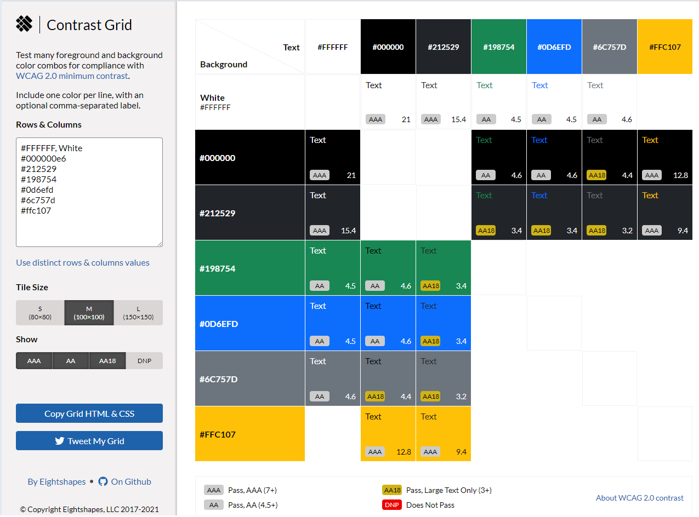
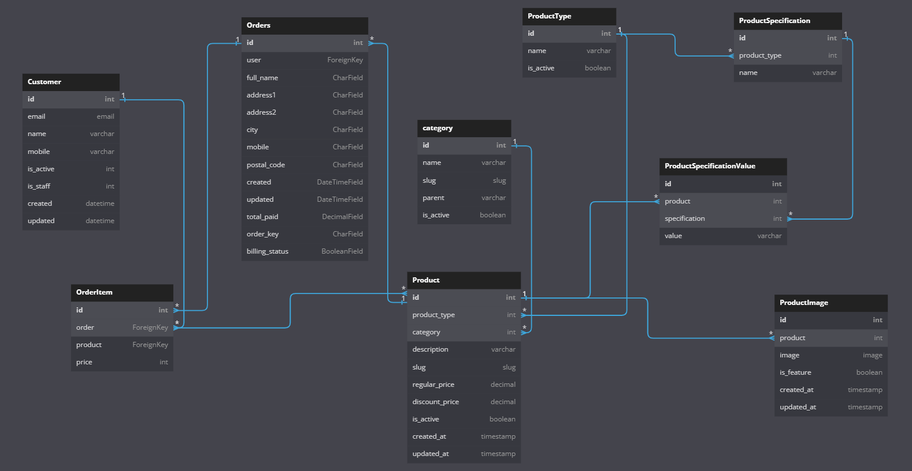
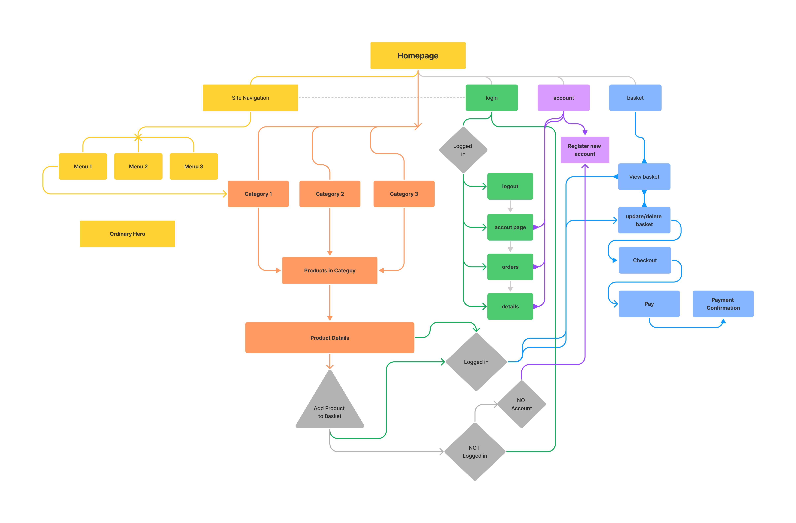

 # MSP4 Hope Services
A Django Framework develope E-Commerce website (For educational purpose only).  

## Table of contents  

1. [Overview](#overview)
2. [Design overview](#design-overview)  
3. [Project goals](#project-goals)  
    3.2 [User goals](#user-goals)  
    3.3 [Site owner goals](#site-owner-goals)  
    3.4 [Target audience](#target-audience)  
4. [User experience](#user-experience)  
    [User stories](#user-stories)  
    4.1 [First time visitor](#first-time-visitor)  
    4.2 [Returning visitor](#returning-visitor)  
    4.3 [Site owner](#site-owner)
5. [Design](#design)  
    5.1 [Structure of application](#structure-of-application)
	5.2 [Logo](#logo)
	5.3 [Pages, Header and Navigation](#pages-header-and-navigation)
	5.4 [Footer Section](#footer-section)
    5.5 [Wireframes](#wireframes)  
    5.6 [Colours and fonts](#colours-and-fonts)  
    5.4 [Icons](#icons)
6. [Features](#features)  
    6.1 [Existing features](#existing-features)  
    6.2 [Future features to be added](#future-features-to-be-added)  
7. [Database](#database)  
    7.1 [Database Diagram](#database-diagram)  
    7.2 [Sitemap](#sitemap)  
    7.3 [Non-logged in user](#non-logged-in-user)
	7.4 [Registered user](#registered-user)
8. [Testing](#testing)  
9. [Technologies used during development](#technologies-used-during-development)  
    9.1 [Languages and frameworks](#languages-and-frameworks) 
	9.2 [Databases](#databases)
    9.3 [Other resources](#other-resources)  
10. [Deployments](#deployments)  
    10.1 [Deploying to Heroku](#deploying-to-heroku)  
    10.2 [Forking the GitHub Repository](#forking-the-github-repository)  
    10.3 [Cloning repository](#cloning-repository)  
11. [Code snippets and tutorials](#code-snippets-and-tutorials)  
  
12. [Acknowledgments](#acknowledgments)

## Overview  
Educational project to showcase the functionality of a very basic database driven e-commerce web application developed with Django Framework. 
The interface is simple, intuitive an clean, with vewry little use of images an colours.

## Design overview  
The Hope Music Academy Services can be use by people of all ages. It has been developed with simplicity in mind and one of the goals is to make it easy and clear to see what is been offered. The target audience will be mostly anyone with interest in hiring music tutoring services, but since this is an eductional project, it will also might be of interest to those who would like to see what can be achieve with the Django platform.

## Project goals  
### User goals  
As first time user – without an account, I want to be able to:

- See what services are available for hire.
- Find detailed information of services are available.
- Choose what services I am interested in.
- View the costs of services.
- Add items to the basket.
- Review, change the quantity and/or delete items in the basket .
- Register/Create an account if I want hire the services.

As a user that has created an account, I want to be able to:

- Do all that a casual user can.
- Log in and out with ease.
- Edit my profile and update details, change of address, name etc.
- View purchase history.
- Make purchase (pay for hired services).

As the shop admin, I want to be able to:

- Add products to the shop.
- Delete a product.
- Edit/ update details of products. 
- Edit/ update the prices of services.
- Create a new user.
- Delete a user.

### Site owner goals 
- User be able to clearly see the products or services provided.
- It is important that users can see their purchases.
- It is also important for the user to be able to edit their datails or delete their account if wanted.

### Target audience
- People of All ages and audiences.
- Pleople looking to hire music tutoring services.
- Pleople that like online services. 
- Those looking to see the Django platfomr functionality.

## User experience
While building the project, it was clear that the user interface had to be simple and functional, clean and easily understood in order to provide an enjoyable positive good user experience. As the application is aimed at all ages, logical placement of buttons and understandable form fields will all be clearly tagged.  

### User stories  
An Excel spreadsheet with user stories and some testing can be found [here](/docs/testing/user_stories/) in the docs folder of the project.
#### First time visitor
- As a first-time user, I want to understand what the purpose of the site.
- As a first-time user, I want to be able to easily navigate to the various categories of products and the platform.
- As a first-time user, I want to easyly register an account and receive an account activation email.
- As a first-time user, I want to be able to add and delete products in the basket.
- As a first-time user, I want to be able to easily view the items in the shopping basket.
- As a first-time user, I want to be able to easily view the total of purchase in the basket.
- As a first-time user, I want to find out information about the selected product/service.
- As a first-time user, I want to see the cost of the product.
- As a first-time user, I want an easy checkout process.

#### Returning visitor
- As a returning user, I want to be able to easily login and logout.
- As a returning user, I want to be able to see my orders.
- As a returning user, I want to be able to see how many movies are in my shopping basket.
- As a returning user, I want to be able to delete my account.
- As a returning user, I want to be able to to edit my details.

#### Site owner
- As the site owner, I want visitors I want visitors understand the platform easily.
- As the site owner, I want visitors to register to purchase/hire the services.
- As the site owner, I want visitors to be able to see the categories of services offered.
- As the site owner, I want visitors to be able to see the selected service details before purchase.
- As the site owner, I want visitors to be able to see the price of the product/service before purchase.
- As the site owner, I want visitors to be able to easily add their choices to the shopping basket for purchase.
- As the site owner, I want visitors to have an easy checkout process. 
- As the site owner, I want visitors to be able to see what they have previously bought.

### Design
#### Structure of application  
### Logo 
The School logo in this case was not used. Instead, the name of the company was used on the left side of the navigation bar 
to continue with concept of clarity and simplicity, easily understood by all audiences.

The colours used are mostly Green, Black and White which contrast each other and give a sense of elegance and clarity throughout the platform.

### Pages, Header and Navigation 
The website platform is responsive therefore it can be view in mobile, tablets and desktops. The header and footer 
are consistent in all the pages of the platform only changing the main content area. Navigation bar / Header is also 
consistent with the navigation buttons on the top right-hand side of the screen and the name of the company on the 
top-left side of the screen.

On devices tablet and mobiles the user will be able to expand/collapse this 3 line menu button that toggles down 
to access the menu items available.

#### Footer section
The footer section only have the copyright info on the left and social media icons on the right, with space for future 
option s to be added later in the middle of the footer.

#### Wireframes
Wireframe designs show navigation concepts for Mobile and Desktop views. Since, both the navbar/header and footer are consistent
throughout the application, wireframes were developed for the above-mentioned and for the main page only as only the main section 
of the page content is changing for every page.  

__Mobile__

Mobile Wireframes

__Desktop__

Desktop Navigation Wireframes

Desktop Footer Wireframes

Desktop Homepage Wireframes

#### Colours and fonts  
The web platform uses a white (#FFFFFF) background throughout the entire application with black font providing good contrast. 
The buttons use green color  or in some instances white and green on mouse hover. We can also see red colour in the basket icon, 
use for highlighting the quantity of items in the basket.

Most od the fonts use a cross the application is Time New Roman size 16px and a font-weight of 400. Include font like: Segoe UI, Roboto, Helvetica with default fall-back of Sans-Serif.

This can be seen here

Contrast Grid was used to contrast combinations and Color Contrast Accessibility Validator used to automatically check the pages. 
Picture below of colours user on the entire web application.

Colour Palette Used as per browser report

Contrast Color Grid

Color Contrast Accessibility Validator

#### Icons
Icons use on the project are Scalable Vector Graphics (svg) from [Freepik](https://www.freepik.com). These are an XML-based markup language for 
describing two-dimensional based vector graphics. As such, it's a text-based, open Web standard for describing images 
that can be rendered cleanly at any size and are designed specifically to work well with other web standards 
including CSS, DOM, JavaScript, and SMIL. SVG is, essentially, to graphics what HTML is to text.

Note: the above definition was taken from MDN Web Docs.
[Can be seen here](https://developer.mozilla.org/en-US/docs/Web/SVG)

## Features  
 Since the application is very basic for educational purposes the main goal here was functionality, 
 hence why the lack of frontend design. This section looks at features which were implemented and those 
 that with further research and knowledge will add to the existing set of features.

### Existing features  
Users can:
- Register and create an account.
- Password recovery and change.
- Edit and delete their details if registered.
- Email notifications (account creation and password recovery only).
- View products. 
- Add product to basket.
- Buy/Pay products (only if registered).
- Responsive e-commerce web application.
- CSRF (cross site request forgery) prevention.
- Backend admin management dashboard (for superuser only).
- User dashboard.
- Secure encrypted payment system provided through Stripe payment gateway api.

### Future features to be added  
- Search function.
- Ability to review products.
- Ability to manage multiple addresses.
- Change/Add profile picture.
- Sorting of products and categories.
- Implement more user feedback for adding or managing items in basket.
- Email confirmation for purchases.
- Revamp the front end with more eye caching design for a better user experience.

## Database  
### Database Diagram  
Database structure diagram outlining the data structure across web application using relational database. 
The PostgresSQL database has been set up as a highly normalised database, which will provide a good structure 
to organise the users, products and orders through the use of relational tables, this approach ensures 
flexibility to incorporate other data tables whilst eliminating redundancy and any inconsistent dependencies.

Navigation menu and Categories and Product are all dependant of the relational database implemented.

### Sitemap   
Flowchart below shows the designed move-ability across the site for a user path for the web application. Notice that 
the any user, register or not, can browse the site and add items to the basket for purchase, but whe it comes to pay for
the added items the user have to have an account. The same goes for viewing purchases or updating user details.

#### Non-logged in user
The navigation bar displays an ‘Account’ icon, this is to allow the user to register for an account 
and then have the ability to pay for items added to the basket.
with the purchasing process.

#### Registered user
The navigation bar displays an ‘Login’ icon, this is to allow the user to pay for items and manage account.

### User journeys  
Add any user stories here, or images something like the login/logout steps  

## Testing
A number of testing were carried out once the application was completed. Documents can 
be found in the folder " [docs](/docs/testing) " for full details of the testng carried out.

Some Unit test / coverage reports were done to the basket app views.py file as well as the store app views.py 
and model.py. The report can be viewed [here](/docs/testing/coverageReport.png) or by downloading the htmlcov 
folder from the repository and opening the index.html file.

## Technologies used during development  
### Languages and frameworks  
- [HTML](https://en.wikipedia.org/wiki/HTML5): is the standard markup language for documents designed to be displayed in a web browser.
- [CSS](https://en.wikipedia.org/wiki/CSS): is a style sheet language used for describing the presentation of a document written in a markup language such as HTML
- [JavaScript](https://en.wikipedia.org/wiki/JavaScript): is a programming language that is one of the core technologies of the World Wide Web, alongside HTML and CSS.
- [JQuery](https://jquery.com/)
- [Python](https://en.wikipedia.org/wiki/Python_(programming_language)): is a high-level, general-purpose programming language.
- [Django](https://www.djangoproject.com/)
- [Jinja](https://en.wikipedia.org/wiki/Jinja_(template_engine))

### Databases 
- [PostgresSQL](https://en.wikipedia.org/wiki/PostgreSQL) (heroku postgres addon)
- [SQLite](https://en.wikipedia.org/wiki/SQLite) - Development database 

### Other resources  
- [GitHub](https://pages.github.com/?(null)), was used to store committed files.
- PyCharm IDE, to develop and commit and push files to GitHub.
- [Figma](https://www.figma.com/), for wireframe designs of the applicaion.
- [Lighthouse](https://developers.google.com/web/tools/lighthouse), used to test performance, accessibility, best practices, and SEO within the Chrome browser.
- [Python JinJa documentation](https://jinja.palletsprojects.com/en/3.1.x/) Used to troubleshoot some templating issues with rendering for loops and count of items in for loops.
- [Black code formatter from Pypi](https://pypi.org/project/black/), used to solve PEP8 issues and ensure code is readable.
- [dbdiagram.io](https://dbdiagram.io/d/63448cf4f0018a1c5fd3f2c9) used to create the database models diagram for the application.
- [PEP8 Validator](http://pep8online.com/) used for the JavaScript code validation.
- [Heroku](https://www.heroku.com/) for the relational database (Postgresql) and deployment.
- [Bootstrap 5](https://getbootstrap.com/) was used for Collapse menu on about page and progress bars shown in the core value section on the same page.
- [Color Contrast Accessibility Validator](https://color.a11y.com/Contrast/)

## Deployments  
### Deploying to Heroku  
This website was developed and hosted using **GitHub pages** and stored in repositories on Github. 

PyCharm was use for the development environment and Git was installed as an extension.

 
The website was deployed using Github Pages and Heroku. To do this while in the github webpages of the project repository: 
1. on the menu that appears on the right-hand side of the page under 'Environments' you can find a link to `github-pages` with anc Active batch on the side.
2. Click on either, github-pages or Environments, it will take you to the `Deployment history` page.
3. Once on the Deployment history page on the right-hand side you will se a `View Deployment` button. 
4. Click on `View Deployment` and this will open the home page of the website in a new window.

Alternatively the links below can be use to directly open the website or go to the repositories:

Link to repositories:
[REPO - MSP4-HopeServices](https://github.com/NickyFrs/MSP4-HopeServices)

Link to Deployed Website:
[Heroku Deployment](https://msp4-hopeservices.herokuapp.com)

### Forking the GitHub Repository  
To make a copy of the original repository on your GitHub account:

1) Log in to GitHub and locate the GitHub Repository you wish to fork
2) At the top of the Repository, to the right above the "Settings" link on the menu, locate the "Fork" Button and select.
3) You should now have a copy of the original repository within your GitHub account.

### Cloning repository  
#### If using VSCode:
- Log into GitHub or create an account.
- Locate the GitHub Repository.
- Under the repository name, click "Clone or download".
- In the Clone with HTTPs section, copy the clone URL for the repository.
- In your local IDE open the terminal.
- Change the current working directory to the location where you want the cloned directory to be created.
- Type 'git clone', and then paste the repository URL.
  
    i.e. git clone https://github.com/USERNAME/REPOSITORY
- Press Enter, the local clone will be created for you.

#### if using Gidpod
- Install the GitPod Browser Extension for Chrome.
- After installation, restart the browser.
- Log into GitHub or create an account.
- Locate the GitHub Repository.
- Select the green "GitPod" button to the right corner of the repository. This will start a new gitPod 
workspace to be created using the code in GitHub.

### Code snippets & Tutorials
[Code Institute Django walk through project](https://codeinstitute.net/full-stack-software-development-diploma/?utm_term=code%20institute&utm_campaign=CI+-+UK+-+Search+-+Brand&utm_source=adwords&utm_medium=ppc&hsa_acc=8983321581&hsa_cam=1578649861&hsa_grp=62188641240&hsa_ad=581730217381&hsa_src=g&hsa_tgt=kwd-319867646331&hsa_kw=code%20institute&hsa_mt=e&hsa_net=adwords&hsa_ver=3&gclid=CjwKCAjwqJSaBhBUEiwAg5W9p3k30OqBaH5pz85MnpLKQzEY3btySrfUk1HjuK9aIjMGcWNHfBhzZhoCrEAQAvD_BwE)   
- ##### Thanks for the visual guidance and help of YouTubers: 
  - Django E-commerce Tutorial Series. GitHub. 2022. django-ecommerce-project/Part-03 User Payment and Order Management/Final at main · veryacademy/django-ecommerce-project. [online] Available at: <https://github.com/veryacademy/django-ecommerce-project/tree/main/Part-03%20User%20Payment%20and%20Order%20Management/Final> [Accessed 15 October 2022].
  - Stripe Docs. Stripe.com. 2022. Accept a card payment. [online] Available at: <https://stripe.com/docs/payments/accept-card-payments?platform=web&ui=elements> [Accessed 15 October 2022].
  - Stripe.com. 2022. Stripe Elements. [online] Available at: <https://stripe.com/docs/payments/elements> [Accessed 16 October 2022].
  - Confirm a PaymentIntent. Stripe.com. 2022. Stripe JS Reference. [online] Available at: <https://stripe.com/docs/js/payment_intents/confirm_card_payment> [Accessed 16 October 2022].
  - Docs.python.org. 2022. 12. Virtual Environments and Packages — Python 3.10.8 documentation. [online] Available at: <https://docs.python.org/3/tutorial/venv.html> [Accessed 16 October 2022].
  - Youtube.com. 2018. Django Tutorial // Build a Video Subscription Website. [online] Available at: <https://www.youtube.com/watch?v=zu2PBUHMEew> [Accessed 16 October 2022].
  - Youtube.com. 2019. How to Build an E-commerce Website with Django and Python. [online] Available at: <https://www.youtube.com/watch?v=YZvRrldjf1Y> [Accessed 16 October 2022].
  - Ivy, D., 2020. Django Stripe Payments Simplified with Donation Page. [online] Youtube.com. Available at: <https://www.youtube.com/watch?v=oZwyA9lUwRk> [Accessed 16 October 2022].
  - Django-allauth.readthedocs.io. 2022. Installation — django-allauth 0.43.0 documentation. [online] Available at: <https://django-allauth.readthedocs.io/en/latest/installation.html> [Accessed 16 October 2022].
  - Ordinarycoders.com. 2021. How to write tests in Django: Best practices for testing in Django. [online] Available at: <https://ordinarycoders.com/blog/article/django-testing> [Accessed 16 October 2022].

## Acknowledgments  
Thank you to my wife and my daughter for the support and understanding throughout the course. I also would like to thank and acknowledge 
my classmates, their support has been invaluable and has helped me to get through this course.

Hope Music Academy, thank you for letting me use their content and allowing me to user your company and materials for support.
To The Code Institute and Harlow College for give me the opportunity to make a new path for myself.
Also to Philip Morris, my tutor, for his guidance, understanding and help with the course.

Good Luck to us all!! :-)